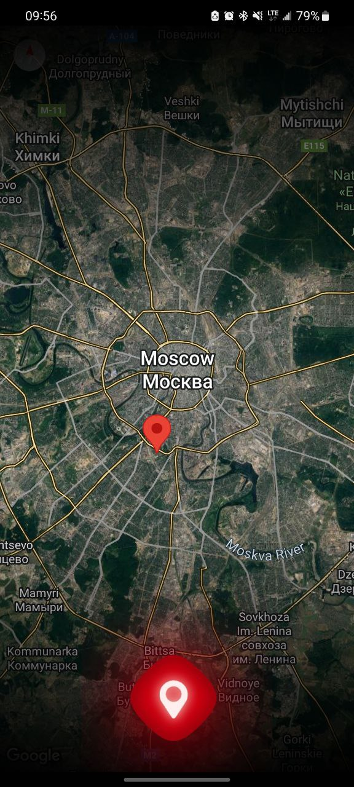

# Anticontroller

This app helps poor students avoid getting caught by traffic controllers on public transport.  

### Functional
The functionality is very simple: if a controller is detected, click on the central button and all users of the application will display your current geolocation

  

